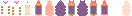

## Introduction
In my game Bumpgun, the sprites look a bit "different" compared to other games.

https://github.com/user-attachments/assets/fc60f47a-11fd-4582-a2d5-7f3eb3f10f51
> lil bouncy boi

If you're wondering, this is how the file for the player looks like:


> body parts

It resembles a spritesheet, but instead of separate animations for the entire player, there are separate parts of the player body.
There are some similar frames, but those are just for animating the player's limbs when jumping, and for the player's gun mode.
The 3D effect is caused through **spritestacking**, a simple method to make 2d objects look "3D"!

## What even is "spritestacking"!?
Spritestacking is a method where images(or spritesheet frames) are rendered on top of each other with a small y-offset that increases with every image rendered.
This gives an illusion where the images imitate 3D faces.
### Code walkthrough
To explain it better, I am going to give you a walkthrough about how this spritestacking function made in pseudo code below works.
```
INPUT: images, position, angle, y-offset:
loop over images:
	draw current image rotated at angle at x = position x, y = position y * index of current image * y-offset
```
This function requires a list of images, coordinates you want to draw on, an angle(in degrees), and the y-offset I mentioned earlier.
Then, it loops over the list of images, drawing the current image rotated by the input angle at the input coordinate x, and at the input coordinate y multiplied by the index of the current image multiplied by the y-offset.

## What should my y-offset be?
The value of the y-offset parameter will depend based on trial and error, but it is best practice to have it bigger than 1, as spritestacking at that scale would look flat. But do not make it any bigger than 3.5, as at that point, the illusion will start to break as at that level, you can clearly see the individual images.

## Animating spritestacks
There are 2 main ways to animate spritestacks, such as:
- ### Spread changing
  Spread changing is changing the y-offset that is input into the spritestacking function every few frames. Good for idle animations.
- ### Frame Swapping
  Frame swapping is where you swap out one of the images input into the spritestacking function for another one every few frames.
## Goodbye
Thank you for making it to the end of this blog. I hope you will read my other blogs in the future.
Goodbye!
> Sources:
https://community.flowlab.io/t/sprite-sandwich-a-guide-to-spritestacking/40779
https://www.youtube.com/watch?v=FNw_BQok14A